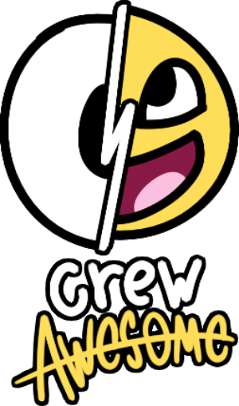
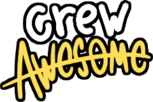

<!-- If this is used at .github/profile/README.md, change image paths to ../../images/brand/... -->

  

  <h1>Crew Awesome</h1>

  
<samp>We make mods, tools, and games. cus we're awesome.</samp>

  

    <a href="https://github.com/Crew-Awesome?tab=repositories">Our Projects!!</a> ·
    <a href="https://discord.gg/zRBKDDEBkb">Crew Awesome Community Discord Server</a>
  

---

## About
Crew Awesome is a team led by ImMalloy!. We build Friday Night Funkin mods, tools, and small games.

## Community
The Vs Memstar Official Discord Server is the homepage for the Crew Awesome Community Discord.  
Invite: https://discord.gg/zRBKDDEBkb

---

   
  © Crew Awesome

